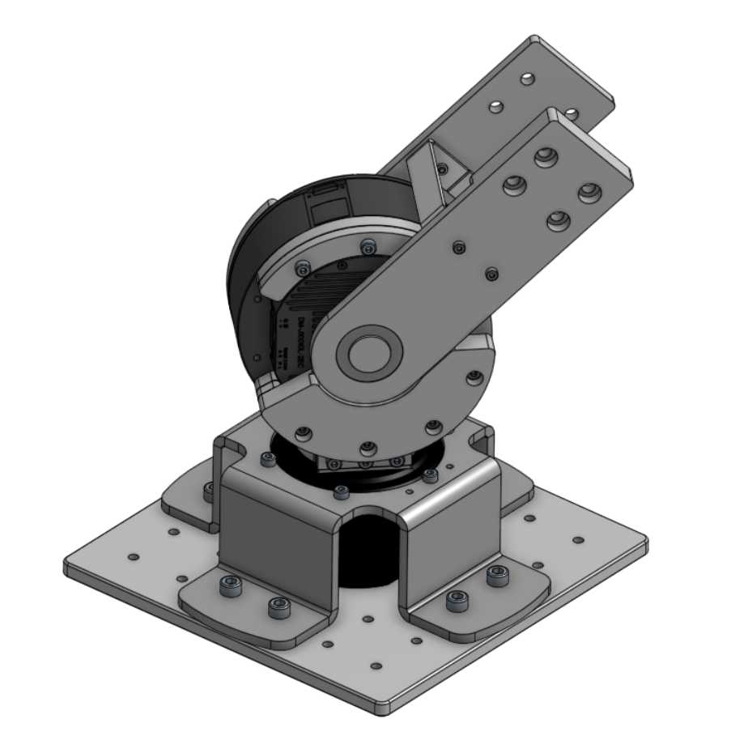
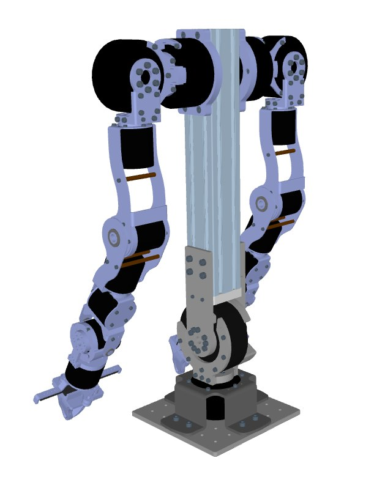

# OpenArm Waist

A waist extension for [OpenArm](https://openarm.dev/), providing additional degrees of freedom and mounting options.

|  |  |
|:---:|:---:|
| Waist Assembly CAD | Full Robot with Waist |

## About

This folder contains the hardware design files for the OpenArm Waist extension. It is designed to be compatible with the standard OpenArm architecture, allowing for enhanced mobility and integration into larger robotic systems.

## BOM

### Manufactured Parts

| Part Name | Manufacturing | Qty | Material | File |
|-----------|---------------|-----|----------|------|
| J_waist_pitch_AB | CNC Machined | 1 | Aluminum 6061 | [`steps/assemble_urdf - J_waist_pitch_AB_CNC.step`](steps/assemble_urdf%20-%20J_waist_pitch_AB_CNC.step) |
| J_waist_pitch_C | CNC Machined | 1 | Aluminum 6061 | [`steps/assemble_urdf - J_waist_pitch_C_CNC.step`](steps/assemble_urdf%20-%20J_waist_pitch_C_CNC.step) |
| J_waist_yaw_A | CNC Machined | 1 | Aluminum 6061 | [`steps/assemble_urdf - J_waist_yaw_A_CNC.step`](steps/assemble_urdf%20-%20J_waist_yaw_A_CNC.step) |
| J_waist_yaw_B | CNC/3D Printed | 1 | Aluminum 6061 | [`steps/assemble_urdf - J_waist_yaw_B_3D.step`](steps/assemble_urdf%20-%20J_waist_yaw_B_3D.step) |
| J_waist_yaw_C | CNC Machined | 1 | Aluminum 6061 | [`steps/assemble_urdf - J_waist_yaw_C.step`](steps/assemble_urdf%20-%20J_waist_yaw_C.step) |
| square_base_plate | CNC Machined | 1 | Aluminum 6061 | [`steps/assemble_urdf - square_base_plate.step`](steps/assemble_urdf%20-%20square_base_plate.step) |
| base_sheet_metal | Sheet Metal | 1 | 304 Steel | [`steps/assemble_urdf - base_sheet_metal.step`](steps/assemble_urdf%20-%20base_sheet_metal.step) |
| J_waist_pitch_D | Sheet Metal | 1 | 304 Steel | [`steps/assemble_urdf - J_waist_pitch_D_for_CNC.step`](steps/assemble_urdf%20-%20J_waist_pitch_D_for_CNC.step) |
| J_waist_yaw_A_A | Sheet Metal | 1 | 304 Steel | [`steps/assemble_urdf - J_waist_yaw_A_CNC_A.step`](steps/assemble_urdf%20-%20J_waist_yaw_A_CNC_A.step) |
| J_waist_yaw_A_B | Sheet Metal | 1 | 304 Steel | [`steps/assemble_urdf - J_waist_yaw_A_CNC_B.step`](steps/assemble_urdf%20-%20J_waist_yaw_A_CNC_B.step) |
| **Full Assembly** | - | 1 | Complete model | [`steps/openarm_waist.step`](steps/openarm_waist.step) |

### Off-The-Shelf Parts

| Part | Description | Specification | Qty | Link |
|------|-------------|---------------|-----|-----------------|
| 6060 Extrusion | Adjust Length based on your usecase | 400mm | 1 | - |
| DM8009P | Damiao 8009P Motor| | 1 | [FoxTech](https://store.foxtech.com/dm-j8009p-2ec-mit-driven-brushless-servo-joint-motor-with-dual-encoders-for-robotic-arms-actuator-for-robot) |
| DM10010L | Damiao 10010L Motor| | 1 | [aifitlab](https://aifitlab.com/products/damiao-dm-j10010l-2ec-servo-motor) |
| F6804ZZ | Flanged ball bearing | 20mm ID × 32mm OD × 7mm W | 1 | [Misumi](https://us.misumi-ec.com/vona2/detail/110300107650/?HissuCode=FL684ZZ&seriesCode=110300107650) |
| M3×10 SHCS | Socket head cap screws | ISO 4762, Stainless Steel | 4 | Standard |
| M4×10 SHCS | Socket head cap screws | ISO 4762, Stainless Steel | 6 | Standard |
| M4×12 SHCS | Socket head cap screws | ISO 4762, Stainless Steel | 12 | Standard |
| M4×18 SHCS | Socket head cap screws | ISO 4762, Stainless Steel | 4 | Standard |
| M4×25 SHCS | Socket head cap screws | ISO 4762, Stainless Steel | 4 | Standard |
| M5×10 SHCS | Socket head cap screws | ISO 4762, Stainless Steel | 6 | Standard |
| M5×18 SHCS | Socket head cap screws | ISO 4762, Stainless Steel | 9 | Standard |
| M6×12 SHCS | Socket head cap screws | ISO 4762, Stainless Steel | 16 | Standard |

## Electronics

Electronics largely follows original openarm setup. We added an additional can device to connect to waist joints.

## License

This project is open-sourced by [QraftyAI](https://qrafty-ai.com). Please refer to the root `LICENSE` file for details.
